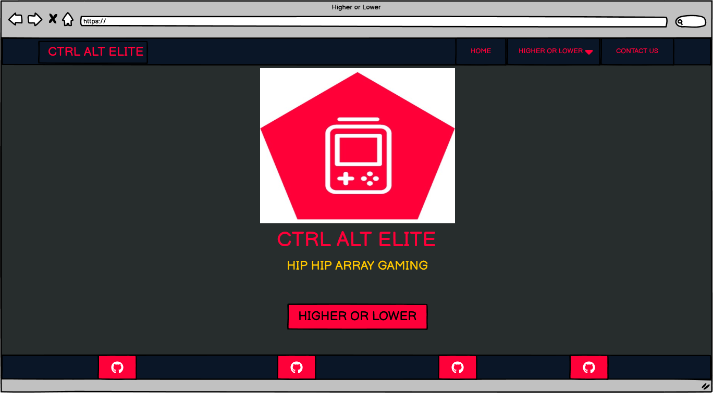

| <a href="https://therickyroy.github.io/higher-and-lower/" target="_blank">Live Project</a> |

## Introduction

Higher or Lower is Frontend Development Hackathon Project as part of Code Institute Full Stack Software Developer Bootcamp. Utilising HTML, CSS, JavaScript and Bootstrap the page allows users to engage with an interactive game of chance requiring them to predict whether the next randomly generated number is higher or lower than the current.

The live project can be found here: <a href="https://therickyroy.github.io/higher-and-lower/" target="_blank">Higher or Lower</a>

<h2 align="center" id="TOC">Table of Contents</h2>

* [CTRL ALT ELITE - Higher or Lower](#)
  - [Introduction](#introduction)
  - [Table of Contents](#TOC)
* [Project Outline](#project-outline)
* [UX Design](#ux-design)
  - [User Stories](#user-stories)
  - [Colors](#colors)
    - [Main Palette](#main-palette)
    - [Contrast](#contrast)
  - [Fonts](#fonts)
  - [Imagery](#imagery)
  - [Wireframes](#wireframes)
* [Features](#features)
  - [General Features](#general-features)
    - [Navigation](#navigation)
    - [Pages](#pages)
      - [Home](#home)
      - [Game](#game)
      - [Rules](#rules)
      - [Leaderboard](#leaderboard)
      - [Contact](#contact)
    - [Footer](#footer)
    - [Links and Buttons](#links-and-buttons)
  - [Resnposive Design](#responsive-design)
  - [Design](#responsive-design)
* [Built With](#built-with)
  - [Technology and Languages](#technologies-and-languages)
  - [Libraries and Frameworks](#libraries-and-frameworks)
  - [Tools & Programs](#tools-and-programs)
* [Development](#deployment)
* [Testing](#testing)
 - [Bugs](#bugs)
* [Credits](#credits)
  - [Code](#code)
  - [Media](#media)
  - [Acknowledgements](#acknowledgements)
  - [Contributors](#contributors)

## Project Outline

<a href="#">Back To Top</a>

## UX Design

<a href="#">Back To Top</a>

## User Stories

### User:

- As a user, I can view the website's Homepage, so that I can play the game it offers.
- As a user, I want a smooth interactive game to play, so I can have fun and come back and play again.
- As a user, I can see my current score update in real-time as I make correct or incorrect guesses, so that I can easily keep track of my progress without needing to refresh the game.
- As a user, I can access the game from both desktop and mobile devices, so that I can play the game seamlessly no matter where I am or what device I am using.
- As a user, I can find the navigation links, so that I can easily navigate the website.
- As a user, I want to be able to choose a difficulty, so that I can make the game easier or more challenging.
- As a user, I can view my high score on the leaderboard, so that I can follow my score and try to beat my personal best.
- As a user, I would like access to a rules page, so that I know how to play the game.
- As a user, I want to be able to provide feedback, so that I can recommend future features I would like to see implemented.
- As a user, I want the option of other game modes, so that I can have multiple options for game play.
- As a user, I would like some in-game content, so that I can personalise my game experience.
- As a user, I want to be able to access social links, so that I can see what else the developers have created.

### Owner:

- As the owner, I want the game to be entertaining and run smoothly, so that users want to come back and play again.
- As the owner, I want the design to be intuitive for users, so they can easily navigate and play the game.
- As the owner, I want to provide clear rules, so users can easily follow and enjoy the game.
- As the owner, I want a place to receive feedback, so users can contribute to the features they would most like to see added.
- As the owner, I want the users to have a leaderboard, so users have the option to review and try and better their scores, to keep them returning.
- As the owner, I want options for additional in-game content, so that I can monetise.
- As the owner, I want to include a leaderboard that encourages players to return and try to beat their high score, fostering competition among users.
- As the owner, I want the game to have minimal load times and run efficiently, so users don’t lose interest while waiting and are more likely to engage.
- As the owner, I want to design the game to work across various platforms (desktop, mobile, tablet), so it is accessible to the widest audience possible and can be played anywhere.
- As the owner, I want to ensure the game's design and interface are visually appealing and easy to navigate, so users enjoy the experience when they land on the homepage.

### Developer:

- As the developer, I want to ensure that users can provide feedback, so that we can make adjustments and/or implement new features in the future.
- As the developer, I want to utilise available frameworks, so I can minimise requirements whilst ensuring responsivity and web standards.
- As the developer, I want to implement JavaScript, so that I can provide interactivity.
- As the developer, I want to explore available options to generate game logic, so that I can ensure a fully functioning game, as intended.
- As a developer, I want to utilise available assets/providers, so I can create an appealing interface and appearance for free.
- As the developer, I want to ensure the game mechanics (higher/lower guessing) work seamlessly across devices and inputs (keyboard and buttons), so users have a consistent experience.
- As the developer, I want to make the game accessible (e.g., keyboard navigation, screen reader support, color contrast for visual impairments), so that users with different abilities can play and enjoy the game.
- As the developer, I want to implement local storage for saving game states and high scores, so users can resume where they left off or track their progress over multiple sessions.
- As the developer, I want to ensure the game works with touch controls (for mobile and tablet devices), so users can interact with the game intuitively across all platforms.
- As the developer, I want to implement responsive design principles, so the game looks and functions properly across different screen sizes (mobile, tablet, desktop).

<a href="#">Back To Top</a>

## Colors

After opting to use a retro gaming aesthetic for the project we were keen to implement a color scheme that would reflect this and generated a series of potential palettes using [coolors.co](https://coolors.co/272d2d-ffc700-fe0039-0a1627-5aa5d9). 

Our initial palette was devised using these options in conjunction with inspiration from our logo design concept developed on [logo.com](https://logo.com/) 

### Main Palette

- Gunmetal `#272d2d` `--grey`
- Mikado Yellow `#ffc700` `--yellow`
- Red (Pantone) `#fe0039` `--red`
- Rich Black `#0a1627` `--blue-dark`
- Ruddy Blue `#5aa5d9` `--blue-light`

Additional Color For Higher Button
- Emerald `#6fcf97` `--green`

### Contrast

Due to failed contrast checks at `AAA Normal` for multiple combinations of colours, we were careful to only use these combinations of colors within elements that adhered to their contrast pass states. 

[Colour Contrast Checker](https://colourcontrast.cc/) (also available as extension on [Chrome Web Store](https://chromewebstore.google.com/detail/colour-contrast-checker/nmmjeclfkgjdomacpcflgdkgpphpmnfe)) was used. 
Both the [WebAIM](https://webaim.org/resources/contrastchecker/) and the [Adobe](https://color.adobe.com/create/color-contrast-analyzer) color contrast tools were used to corroborate these results.

<a href="#">Back To Top</a>

## Fonts

We selected a pair of fonts that adopt the retro gaming style whilst maintaining a clean and clear visual for the user experience.

[Silkscreen](https://fonts.google.com/specimen/Silkscreen) - Retro Pixelated Font For Headings

[Oxanium](https://fonts.google.com/specimen/Oxanium) - Complementary For For Body

<a href="#">Back To Top</a>

## Imagery

<a href="#">Back To Top</a>

## Wireframes

<a href="#">Back To Top</a>

## Features

<a href="#">Back To Top</a>

## General Features

<a href="#">Back To Top</a>

## Navigation 

<a href="#">Back To Top</a>

## Pages

<a href="#">Back To Top</a>

## Home

<a href="#">Back To Top</a>

## Game

<a href="#">Back To Top</a>

## Rules

### Objective
The goal is to correctly guess whether the next card drawn will be higher or lower than the current card.

### Gameplay Instructions
- **First Card:** The dealer reveals the top card from the shuffled deck and places it face up.
- **Guessing:** The player must guess whether the next card drawn will be higher or lower than the revealed card.
  - If the guess is correct, they score a point and continue playing.
  - If incorrect, they score no points, and your score resets.

### Special Rules
- **Same Value Rule:** If a player draws a card of the same value as the previous card, the player wins.

### Controls
- **Press the UP arrow button** to select Higher
- **Press the DOWN arrow button** to select Lower
- **On keyboard:**
  - ‘H’ or Up key = Higher
  - ‘L’ or Down key = Lower

### Winning
Your points will continue to increment for every correct guess. On an incorrect guess, your points will be reset.

<a href="#">Back To Top</a>

## Leaderboard

<a href="#">Back To Top</a>

## Contact

<a href="#">Back To Top</a>

## Footer

<a href="#">Back To Top</a>

## Links & Buttons

<a href="#">Back To Top</a>

## Responsive Design

<a href="#">Back To Top</a>

## Built With

<a href="#">Back To Top</a>

### Technology and Languages

### Libraries and Frameworks

### Tools and Programs

<a href="#">Back To Top</a>

## Development

## Deployment

This [GitHub](https://therickyroy.github.io/higher-and-lower/) project was created using the [Code Institute](https://github.com/Code-Institute-Org/ci-full-template) Template, which ensured that all necessary dependencies were included when opening within the designated workspace on [Gitpod IDE](https://www.gitpod.io/).

Set up a repo using this method and template:

1. Login to your GitHub profile.
2. Navigate to the Code Institute Full Template.
3. Click the dropdown for 'Use this template' and select "Create a new repository".
4. Generate the necessary name and description for your repo and click 'Create repository from template'.
    * Ensure the repository is created within the correct organisation if working as a group.
    * Set the repository to private or public depending on the group’s requirements.
5. Navigate to the new repository and click the green 'Open' button with the Gitpod logo.
    * **IMPORTANT** - This button should only be clicked once to generate the new IDE workspace.
    * Other group members should fork the repository or clone it locally to prevent overwriting the master IDE workspace.
6. You can now work on your repository within the Code Institute Gitpod IDE workspace.

### Early Deployment:
* Once the project repository is created, an early deployment for the live project should be performed.
* This allows for early and continuous testing using a variety of devices, as well as the Dev Tools available within browsers.

### Cloning and Branching for Group Members:
* Each group member should fork the repository or clone the repository locally to avoid conflicts.
* We will create feature branches for each new feature or bug fix (e.g., `feature/user-auth`, `fix/score-bug`).
* Do not work directly on the `main` branch to ensure the main project remains stable.
* Push your changes to your own branch and open a pull request (PR) for review before merging into the `main` branch.
* Assign relevant group members to review PRs and approve them before merging.

### Commit Guidelines:
* Use clear, concise commit messages, following the group’s established guidelines (e.g., “Add user authentication feature” or “Fix styling issue on mobile view”).
* Make smaller, frequent commits to ensure code changes can be easily tracked and understood by everyone in the group.

### Pulling Updates Regularly:
* Regularly pull changes from the `main` branch into your working branch to stay up-to-date with everyone’s changes.
* Resolve any merge conflicts locally before pushing changes to avoid issues in the `main` branch.

### Continuous Integration:
* Implement Continuous Integration (CI) tools, such as GitHub Actions, to automate tests or deployments after each merge.
* Ensure all group members are aware of any test failures or deployment issues after their code is merged.

### Deployment Information:
* Additional details about the deployment process can be found in the official GitHub Docs or in our project’s README file, which should include steps for deployment to ensure consistency across the group.

<a href="#">Back To Top</a>

## Testing

<a href="#">Back To Top</a>

### Bugs

<a href="#">Back To Top</a>

## Credits

<a href="#">Back To Top</a>

## Code

<a href="#">Back To Top</a>

### Media

<a href="#">Back To Top</a>

### Acknolwedgements

<a href="#">Back To Top</a>

### Contributors

Made with [contrib.rocks](https://contrib.rocks)

<a href="#">Back To Top</a>
